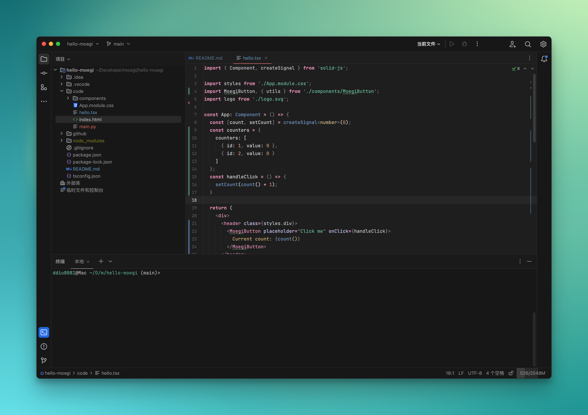

# Moegi Theme for JetBrains

> Work in Progress! 

## Features

- Two accent colors in one theme - unsaturated cold green (`#66b395`) and... light warm red (`#ff8787`)
- No flat ui - you work in a real editor instead of on a whiteboard
- Optimized for text selection and search

## See More

- [Moegi Theme for VS Code](https://github.com/moegi-design/vscode-theme)

## License

MIT
